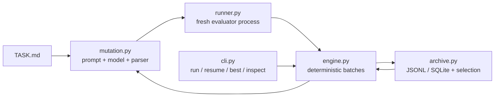

<div align="center">

# NanoEvolve

**The smallest useful evolutionary programming loop.**

Preserve AlphaEvolve's generate–verify–select feedback loop, remove OpenEvolve's research infrastructure, and rebuild it around Pi's primitives-first, file-based, fully observable philosophy.

[简体中文](README.zh-CN.md) · [Design specification](docs/superpowers/specs/2026-08-02-nanoevolve-design.md) · [Changelog](CHANGELOG.md) · [Contributing](CONTRIBUTING.md)


</div>

```text
Archive --select--> Prompt --> Model --> Candidate
   ^                                      |
   |                                      v
   +------------- Evaluation <-- Evaluator
```

NanoEvolve keeps the useful core of AlphaEvolve-style systems—`select → mutate → evaluate → archive`—without turning it into an agent framework. There is no tool loop, planner, sub-agent system, hidden memory, plugin registry, or database.

## Why NanoEvolve?

- **Small control surface:** one `evolve()` function and four CLI commands.
- **Visible state:** exact prompts, raw responses, candidates, scores, and errors stay on disk.
- **Recoverable runs:** append-only JSONL records rebuild the archive after interruption.
- **Deterministic selection:** each generation derives its own stable random seed.
- **Evaluator-owned truth:** domain logic stays in an ordinary `evaluate.py` function.
- **Zero runtime dependencies:** the core uses only the Python standard library.

## Three-Minute Experience

The deterministic demo requires no API key and makes no network request.

```bash
python -m venv .venv
source .venv/bin/activate
python -m pip install -e .
python examples/hello_evolve/demo.py
```

Expected ending:

```text
NanoEvolve deterministic demo completed.
Best score: 8.0
Inspect: nanoevolve inspect /tmp/nanoevolve-hello-... <record-id>
```

The printed temporary project remains available for the CLI:

```bash
nanoevolve best /tmp/nanoevolve-hello-...
nanoevolve inspect /tmp/nanoevolve-hello-... <record-id>
```

## Reproducible Benchmark

Run a deterministic eight-point packing trajectory without an API key or network access:

```bash
python examples/circle_packing/demo.py
```

The run improves the minimum pairwise distance from `0.4000000000` to `0.5176380902` across three inspectable generations. It is a compact benchmark of the actual generate–evaluate–select–archive loop rather than a synthetic score counter.

## Run a Real Model

Create or reuse a project with three explicit files:

```text
my-experiment/
├── TASK.md
├── seed.py
└── evaluate.py
```

Configure any OpenAI-compatible, non-streaming endpoint:

```bash
export NANOEVOLVE_MODEL="your-model"
export NANOEVOLVE_BASE_URL="https://your-endpoint.example/v1"
export NANOEVOLVE_API_KEY="..."

nanoevolve run my-experiment \
  --iterations 100 \
  --random-seed 42 \
  --target-score 0.95
```

Resume to a total generation target:

```bash
nanoevolve resume my-experiment --iterations 200
```

`resume --iterations 200` means “reach generation 200,” not “run 200 more attempts.” Repeating it after generation 200 performs no additional model calls.

`--target-score` stops before the next generation batch once any successful candidate reaches the requested score. The target is stored in `run.json` and reused by `resume`. With `workers > 1`, already-started candidates in the current batch are still evaluated and committed before the run stops.

## Minimal Python API

```python
from nanoevolve import OpenAICompatibleModel, evolve
from evaluate import evaluate

model = OpenAICompatibleModel(
    model="your-model",
    base_url="https://your-endpoint.example/v1",
    api_key="...",
)

best = evolve(
    seed="seed.py",
    evaluate=evaluate,
    model=model,
    task="TASK.md",
    iterations=100,
    target_score=0.95,
)

print(best.evaluation.score)
print(best.source_path)
```

The evaluator is a top-level importable function:

```python
from nanoevolve import Evaluation


def evaluate(source_path: str) -> Evaluation:
    score = run_benchmark(source_path)
    return Evaluation(
        score=score,
        feedback="Benchmark completed.",
        metrics={"runtime_ms": 12.4},
    )
```

`score` remains the default optimization target. Named metrics can also drive lexicographic objectives and MAP-Elites feature coordinates.

## CLI

| Command | Purpose |
| --- | --- |
| `nanoevolve run <project>` | Start a new run and refuse existing state. |
| `nanoevolve resume <project>` | Continue to a total generation target. |
| `nanoevolve best <project>` | Show the highest-scoring successful record. |
| `nanoevolve inspect <project> <record-id>` | Trace lineage, evaluation, errors, and artifacts. |

`best` and `inspect` support `--json` for scripts.

`run` and `resume` support a line-oriented event stream on stderr while keeping the final best-record summary on stdout:

```bash
nanoevolve run my-experiment --iterations 100 --json-events 2>events.jsonl
```

Each line in `events.jsonl` is one JSON object with `type`, `generation`, `record_id`, and `data`. The stream includes parent selection, model completion, candidate extraction, archive commits, failures, and new-best events.

`inspect` can also print one persisted artifact exactly as stored, without labels or formatting:

```bash
nanoevolve inspect my-experiment <record-id> --artifact prompt > prompt.txt
```

Use the artifact names shown by ordinary `inspect` output. `--artifact` and `--json` are mutually exclusive.

## Roadmap Features

All advanced behavior is opt-in and still enters through `evolve()` or the existing `run`/`resume` commands:

```bash
nanoevolve run my-experiment \
  --mutation-mode search_replace \
  --inspiration-count 2 \
  --artifact-feedback stdout \
  --workers 4 \
  --archive-backend sqlite \
  --objective score:max \
  --objective runtime_ms:min \
  --feature size \
  --feature-bin size=100 \
  --islands 4 \
  --migration-interval 20 \
  --target-score 0.95
```

- Use a `seed/` directory instead of `seed.py` for multi-file workspaces; evaluators receive the workspace directory path.
- `full`, `search_replace`, and `evolve_blocks` mutation modes support complete snapshots, exact patches, and named editable regions.
- `--sandbox-command "..."` wraps evaluator workers with an external isolation command; credentials must come from its environment, not command arguments.
- `workers > 1` generates a deterministic batch sequentially, evaluates it concurrently, and commits records in generation order.
- SQLite changes only the record index. Prompts, responses, workspaces, outputs, and evaluations remain ordinary hashed files.
- Feature metrics plus bins activate simplified MAP-Elites. Islands select locally and widen the pool on migration generations.
- `target_score` / `--target-score` stops model calls at the next batch boundary and emits a visible `target_reached` event.

Run the deterministic combined showcase without an API key or network access:

```bash
python examples/roadmap_showcase/demo.py
```

It exercises the multi-file, SEARCH/REPLACE, inspiration, artifact feedback, parallel evaluator, SQLite, multi-objective, MAP-Elites, island, and migration paths in one inspectable run.

## Version and Release Verification

The installed console script and module entry point share the same parser and version source:

```bash
nanoevolve --version
python -m nanoevolve --version
```

Before publishing or handing off a source snapshot, run:

```bash
python scripts/release_check.py
```

The release checker runs tests and compilation, verifies bilingual README structure, enforces the core line budget, checks package metadata, and rejects release-facing placeholders.

Release infrastructure is intentionally separate from runtime dependencies. Wheel and source-distribution builds use the development-only `build` package; installed NanoEvolve still declares zero runtime dependencies.

See [`CONTRIBUTING.md`](CONTRIBUTING.md) for development conventions, [`SECURITY.md`](SECURITY.md) for the generated-code trust boundary, and [`CHANGELOG.md`](CHANGELOG.md) for validated milestones.

The public repository is `BokaiGuo-Lincoln/nanoevolve`. Package author and license fields remain unset until the project owner provides authoritative values.

## Transparent State

Each project gets one inspectable state directory:

```text
.nanoevolve/
├── run.json
├── records.jsonl or records.sqlite3
└── candidates/
    └── <record-id>/
        ├── source.py or workspace/...
        ├── prompt.txt
        ├── response.txt
        ├── evaluation.json
        ├── stdout.txt
        └── stderr.txt
```

`run.json` is immutable initial metadata. `records.jsonl` is the default dynamic state truth; `records.sqlite3` is an opt-in equivalent index. Candidate artifacts are written before their record becomes visible, and hashes are verified when the archive reopens.

Every mutation attempt consumes one generation—including invalid model responses, evaluator errors, and timeouts. Failed attempts remain inspectable but never enter the parent pool.

## Architecture



The six semantic modules remain concrete. NanoEvolve has no policy hierarchy, provider registry, hidden memory, or observer framework.

## Selection

The default parent policy is deliberately small:

- With probability `0.8`, sample from the top five successful records using rank weights.
- With probability `0.2`, explore uniformly across all successful records.
- Derive randomness from `SHA-256(run_seed, generation)`.
- Resolve score ties by record ID.

Optional selection layers are explicit: lexicographic score/metric objectives, metric-binned MAP-Elites, and deterministic islands with periodic migration. Leaving their flags unset preserves the original top-k behavior.

## Security Boundary

> **Important:** `SubprocessRunner` provides fault isolation, not a security sandbox.

Generated code and evaluators may still access the network, user-readable files, system programs, and same-user processes. Run untrusted evolution inside Docker, Podman, a virtual machine, or another external sandbox.

The default evaluator subprocess removes environment variables whose names contain `API_KEY`, `ACCESS_TOKEN`, `AUTH_TOKEN`, `SECRET`, or `PASSWORD`.

## Roadmap

### v0.1 — Nano core

- [x] Full-source mutation format
- [x] Sequential evolution loop
- [x] Append-only JSONL archive
- [x] Deterministic top-k plus exploration
- [x] Subprocess evaluator with explicit failure states
- [x] `run`, `resume`, `best`, and `inspect`
- [x] Deterministic no-network demo

### v0.1.1 — Release hardening

- [x] `python -m nanoevolve` and shared `--version` support
- [x] Typed wheel and explicit source-distribution contents
- [x] Cross-platform CI matrix and package-build job
- [x] Standard-library release checker
- [x] Contributor guide, security policy, and changelog
- [x] Clean-wheel install and installed CLI/demo verification

### v0.2 — Stronger mutation context

- [x] SEARCH/REPLACE diffs
- [x] EVOLVE-BLOCK regions
- [x] Inspiration candidates
- [x] Artifact feedback

### v0.3 — Mini workspace

- [x] Multi-file workspaces
- [x] External sandbox command integration
- [x] Parallel evaluator workers
- [x] Optional SQLite archive
- [x] Multiple selection metrics

### v0.4 — Quality diversity

- [x] Simplified MAP-Elites
- [x] User-provided feature coordinates
- [x] Optional islands and migration

### v0.5 — Target-aware stopping

- [x] Persisted target score for Python and CLI runs
- [x] Seed and resume pre-checks with zero unnecessary model calls
- [x] Explicit `target_reached` events
- [x] Deterministic parallel batch-boundary semantics

The published v0.2-v0.5 roadmap is implemented. Future features still require concrete evidence from real runs; parity with a larger framework is not a goal.

## Development

```bash
python -m unittest discover -s tests -v
python -m compileall nanoevolve examples
python scripts/release_check.py
python -m nanoevolve --version
```

The detailed design and implementation checklist live in:

- [`docs/superpowers/specs/2026-08-02-nanoevolve-design.md`](docs/superpowers/specs/2026-08-02-nanoevolve-design.md)
- [`tasks/plan.md`](tasks/plan.md)
- [`tasks/todo.md`](tasks/todo.md)
- [`docs/superpowers/specs/2026-08-02-v0.1.1-release-hardening-design.md`](docs/superpowers/specs/2026-08-02-v0.1.1-release-hardening-design.md)

## Project Boundary

NanoEvolve is not a complete AlphaEvolve reproduction and is not an autonomous coding agent. It is a transparent evolutionary programming kernel designed to be read, embedded, inspected, and extended with ordinary Python.
