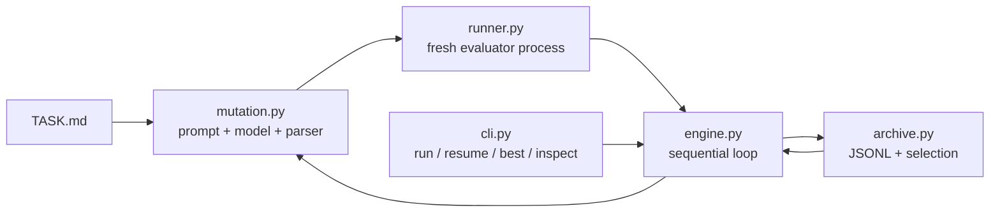

<div align="center">

# NanoEvolve

**能够成立的最小程序进化闭环。**

把 LLM 当作 mutation operator；选择、评估、状态和停止条件始终由确定性程序控制。

[English](README.md) · [设计规范](docs/superpowers/specs/2026-08-02-nanoevolve-design.md) · [变更日志](CHANGELOG.md) · [贡献指南](CONTRIBUTING.md)


</div>

```text
Archive --select--> Prompt --> Model --> Candidate
   ^                                      |
   |                                      v
   +------------- Evaluation <-- Evaluator
```

NanoEvolve 保留 AlphaEvolve 类系统真正有用的计算内核——`select → mutate → evaluate → archive`——但不把它扩张成 agent 框架。核心没有工具循环、规划器、sub-agent、隐藏记忆、插件注册中心或数据库。

## 为什么是 NanoEvolve？

- **极小控制面：** 一个 `evolve()` 函数和四个 CLI 命令。
- **状态完全可见：** prompt、原始响应、候选、评分和错误全部落盘。
- **运行可恢复：** append-only JSONL 可以在中断后重建 archive。
- **选择可复现：** 每一代都派生独立、稳定的随机种子。
- **Evaluator 决定真值：** 领域逻辑保留在普通 `evaluate.py` 函数中。
- **零运行时依赖：** 核心只使用 Python 标准库。

## 三分钟快速体验

确定性示例不需要 API key，也不会发起网络请求。

```bash
python -m venv .venv
source .venv/bin/activate
python -m pip install -e .
python examples/hello_evolve/demo.py
```

结尾输出类似：

```text
NanoEvolve deterministic demo completed.
Best score: 8.0
Inspect: nanoevolve inspect /tmp/nanoevolve-hello-... <record-id>
```

脚本打印出的临时项目会继续保留，可以直接用 CLI 查看：

```bash
nanoevolve best /tmp/nanoevolve-hello-...
nanoevolve inspect /tmp/nanoevolve-hello-... <record-id>
```

## 接入真实模型

一个实验只需要三个显式文件：

```text
my-experiment/
├── TASK.md
├── seed.py
└── evaluate.py
```

配置任意兼容 OpenAI Chat Completions、非 streaming 的端点：

```bash
export NANOEVOLVE_MODEL="your-model"
export NANOEVOLVE_BASE_URL="https://your-endpoint.example/v1"
export NANOEVOLVE_API_KEY="..."

nanoevolve run my-experiment --iterations 100 --random-seed 42
```

恢复到指定总代数：

```bash
nanoevolve resume my-experiment --iterations 200
```

`resume --iterations 200` 表示“推进到 generation 200”，不是“额外执行 200 次”。达到 200 代后重复执行不会再次调用模型。

## 最小 Python API

```python
from nanoevolve import OpenAICompatibleModel, evolve
from evaluate import evaluate

model = OpenAICompatibleModel(
    model="your-model",
    base_url="https://your-endpoint.example/v1",
    api_key="...",
)

best = evolve(
    seed="seed.py",
    evaluate=evaluate,
    model=model,
    task="TASK.md",
    iterations=100,
)

print(best.evaluation.score)
print(best.source_path)
```

Evaluator 必须是一个可导入的顶层函数：

```python
from nanoevolve import Evaluation


def evaluate(source_path: str) -> Evaluation:
    score = run_benchmark(source_path)
    return Evaluation(
        score=score,
        feedback="Benchmark completed.",
        metrics={"runtime_ms": 12.4},
    )
```

v0.1 只优化 `score`。`metrics` 会被完整记录，但不参与选择。

## CLI

| 命令 | 作用 |
| --- | --- |
| `nanoevolve run <project>` | 创建新运行；存在旧状态时拒绝覆盖。 |
| `nanoevolve resume <project>` | 恢复并推进到指定总代数。 |
| `nanoevolve best <project>` | 显示当前最高分成功记录。 |
| `nanoevolve inspect <project> <record-id>` | 检查 lineage、评估、错误和 artifacts。 |

`best` 和 `inspect` 支持 `--json`，便于脚本集成。

## 版本与发布验证

安装后的 console script 与模块入口共享同一套 parser 和版本来源：

```bash
nanoevolve --version
python -m nanoevolve --version
```

发布或交付源码快照之前运行：

```bash
python scripts/release_check.py
```

发布检查会运行测试和编译，验证中英文 README 结构，约束核心代码行数，检查 package metadata，并拒绝发布文档中的占位符。

发布基础设施与运行时依赖严格分离。Wheel 和 source distribution 使用仅供开发的 `build` 包；安装后的 NanoEvolve 仍声明零运行时依赖。

开发约定见 [`CONTRIBUTING.md`](CONTRIBUTING.md)，生成代码的信任边界见 [`SECURITY.md`](SECURITY.md)，已验证里程碑见 [`CHANGELOG.md`](CHANGELOG.md)。

作者、许可证、仓库 URL 和发布目标会保持空缺，直到项目所有者提供权威信息。

## 透明状态

每个项目只有一个可直接检查的状态目录：

```text
.nanoevolve/
├── run.json
├── records.jsonl
└── candidates/
    └── <record-id>/
        ├── source.py
        ├── prompt.txt
        ├── response.txt
        ├── evaluation.json
        ├── stdout.txt
        └── stderr.txt
```

`run.json` 是不可变的初始元数据；`records.jsonl` 是唯一动态状态真相。候选 artifacts 会先写入磁盘，再让对应 record 对后续选择可见；archive 重新打开时会验证文件哈希。

每一次 mutation attempt 都消耗一个 generation，包括非法模型响应、evaluator 异常和超时。失败尝试永久可检查，但不会进入 parent pool。

## 架构



六个语义模块保持具体而透明。v0.1 不提供 archive 抽象基类、policy 类层级、provider registry 或 observer framework。

## 选择策略

默认 parent 策略刻意保持简单：

- 概率 `0.8`：从最高分的五个成功记录中按排名权重采样。
- 概率 `0.2`：在全部成功记录中均匀探索。
- 随机性来自 `SHA-256(run_seed, generation)`。
- 同分记录通过 record ID 稳定排序。

MAP-Elites、岛屿迁移和多目标选择是后续可选能力，不是隐藏在核心中的默认行为。

## 安全边界

> **重要：** `SubprocessRunner` 提供的是故障隔离，不是真正的安全沙箱。

生成代码和 evaluator 仍可能访问网络、用户可读文件、系统程序和同一用户的其他进程。对于不可信代码，请在 Docker、Podman、虚拟机或其他外部 sandbox 中运行整个实验。

默认 evaluator 子进程会移除名称中包含 `API_KEY`、`ACCESS_TOKEN`、`AUTH_TOKEN`、`SECRET` 或 `PASSWORD` 的环境变量。

## 路线图

### v0.1 — Nano core

- [x] 完整源码 mutation 格式
- [x] 顺序进化循环
- [x] Append-only JSONL archive
- [x] 确定性 top-k + exploration
- [x] 具有显式失败状态的 subprocess evaluator
- [x] `run`、`resume`、`best`、`inspect`
- [x] 无网络确定性示例

### v0.1.1 — 发布硬化（尚未发布）

- [x] `python -m nanoevolve` 与共享 `--version`
- [x] Typed wheel 与显式 source distribution 内容
- [x] 跨平台 CI matrix 和 package-build job
- [x] 纯标准库 release checker
- [x] 贡献指南、安全政策和变更日志
- [x] Clean-wheel 安装与 installed CLI/demo 验证

### v0.2 — 更强 mutation context

- [ ] SEARCH/REPLACE diff
- [ ] EVOLVE-BLOCK 区域
- [ ] Inspiration candidates
- [ ] Artifact feedback

### v0.3 — Mini workspace

- [ ] 多文件 workspace
- [ ] 外部 sandbox command
- [ ] 并行 evaluator workers
- [ ] 可选 SQLite archive
- [ ] 多指标选择

### v0.4 — Quality diversity

- [ ] 简化 MAP-Elites
- [ ] 用户提供 feature coordinates
- [ ] 可选 islands 与 migration

只有真实运行暴露出明确需求时，能力才会进入下一阶段；“功能对齐更大的框架”不是路线图目标。

## 开发与验证

```bash
python -m unittest discover -s tests -v
python -m compileall nanoevolve examples
python scripts/release_check.py
python -m nanoevolve --version
```

完整设计与实施清单：

- [`docs/superpowers/specs/2026-08-02-nanoevolve-design.md`](docs/superpowers/specs/2026-08-02-nanoevolve-design.md)
- [`tasks/plan.md`](tasks/plan.md)
- [`tasks/todo.md`](tasks/todo.md)
- [`docs/superpowers/specs/2026-08-02-v0.1.1-release-hardening-design.md`](docs/superpowers/specs/2026-08-02-v0.1.1-release-hardening-design.md)

## 项目边界

NanoEvolve 不是完整 AlphaEvolve 复现，也不是自主 coding agent。它是一个可以被阅读、嵌入、检查并通过普通 Python 扩展的透明程序进化内核。
